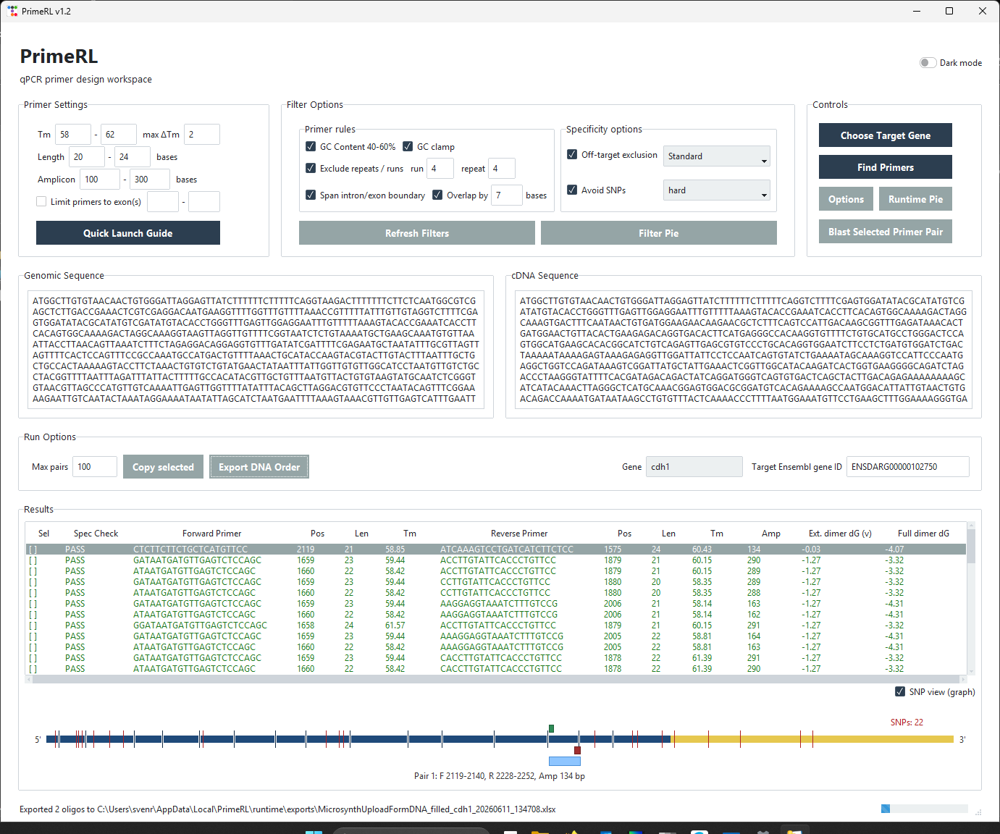
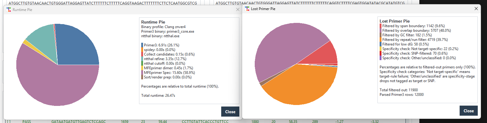
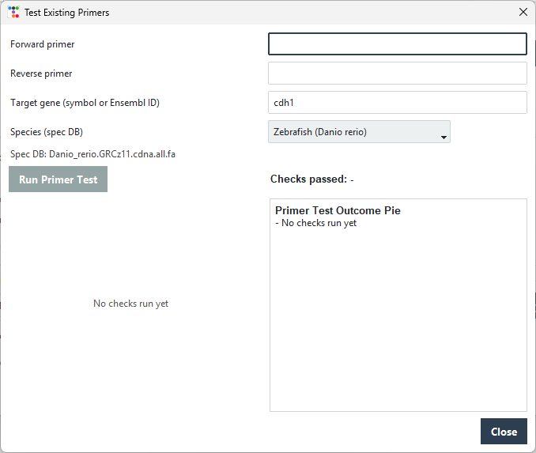

# PrimeRL

PrimeRL is a local qPCR primer design workspace that combines sequence retrieval, primer generation, thermodynamic refinement, transcriptome off-target screening, and SNP-aware filtering in one GUI-driven workflow.

PrimeRL extends a standard `Primer3`-based workflow with layered post-filtering through `ntthal` and `MFEprimer`, transcript-aware placement logic, and optional retesting of existing primers.

## Get PrimeRL

- Source code: this repository
- Windows users: download a packaged release from **GitHub Releases**
- Local development: run the GUI directly with Python

PrimeRL is designed for users who want a transparent, locally reproducible qPCR primer workflow rather than a black-box web-only design step.

## What PrimeRL Does

- fetches genomic and cDNA context from Ensembl
- designs candidate primer pairs with Primer3
- supports transcript-aware exon/intron boundary placement
- refines dimer risk with ntthal
- screens primer dimers and transcriptome specificity with MFEprimer
- supports SNP-aware primer avoidance
- exports order-ready primer tables
- retests existing primer pairs with the same local QC logic

## Why It Exists

qPCR primer design often becomes expensive through iteration: redesigns, failed assays, weak specificity, or hidden SNP problems. PrimeRL was built to make this process more systematic, more transparent, and easier to repeat locally.

The workflow is designed to answer not only which primer pairs survive, but also why other candidates were removed.

## Screenshots

### Main Workspace



### Runtime and Filter Statistics



### Existing Primer Retesting



## Workflow Summary

1. Enter a target gene symbol or Ensembl ID
2. Retrieve transcript and sequence context from Ensembl
3. Generate candidate primer pairs with Primer3
4. Apply transcript-aware structural filters
5. Refine thermodynamic risk with ntthal
6. Screen remaining pairs with MFEprimer
7. Review final ranked primer pairs and export for ordering

## Key Differences From A Simple Primer3 + Primer-BLAST Workflow

- integrated local workflow instead of scattered tools
- explicit thermodynamic refinement with `ntthal`
- transcriptome-level off-target testing with `MFEprimer`
- SNP-aware primer avoidance
- transcript-aware intron/exon boundary logic
- candidate-loss and runtime visualizations
- retesting path for existing primer pairs

## Key Upstream Projects

- [Primer3](https://github.com/primer3-org/primer3) - primer design engine and thermodynamic utilities
- [MFEprimer](https://github.com/quwubin/MFEprimer-3.0) - primer dimer and transcriptome specificity screening
- [Ensembl](https://www.ensembl.org/) - transcript, genomic, and transcriptome reference source
- [Spidey / NCBI](https://www.ncbi.nlm.nih.gov/spidey/) - exon/intron alignment support
- [OpenPyXL](https://pypi.org/project/openpyxl/) - Excel export support

Bundled third-party notices and license details are documented in [`docs/THIRD_PARTY_NOTICES.md`](docs/THIRD_PARTY_NOTICES.md).

## Quick Start

Run the GUI locally:

```powershell
python .\run_gui.py
```

PrimeRL expects the required external tools and local runtime assets to be available in your working setup. Packaged releases include the intended runtime layout; source checkouts are aimed at local development and build workflows.

Run the test suite:

```powershell
$env:PYTHONPATH = ".\src"
python -m unittest discover -s .\tests -v
```

## Build Notes

Build Windows artifacts locally:

```powershell
powershell -NoProfile -ExecutionPolicy Bypass -File .\release\scripts\build_exe.ps1 -Version 1.3.4 -Clean
powershell -NoProfile -ExecutionPolicy Bypass -File .\release\scripts\build_msi.ps1 -Version 1.3.4 -Clean
```

Build macOS `.app` and signing artifacts:

```bash
./release/scripts/build_app_macos.sh --version 1.3.4 --clean
./release/scripts/sign_app_macos.sh --app release/PrimeRL_1.3.4_app_macos_arm64_nodb/dist/PrimeRL.app
./release/scripts/notarize_app_macos.sh --app release/PrimeRL_1.3.4_app_macos_arm64_nodb/dist/PrimeRL.app --keychain-profile PRIMERL_NOTARY
```

Build Linux app and `.deb`:

```bash
./release/scripts/prepare_linux_tools.sh
./release/scripts/build_linux_app.sh --version 1.3.4 --clean
./release/scripts/build_deb.sh --version 1.3.4 --clean --app-dir release/PrimeRL_1.3.4_app_linux_x86_64_nodb/dist/PrimeRL
```

See also:

- `release/README_BUILD_WINDOWS.md`
- `release/README_BUILD_MACOS.md`
- `release/README_BUILD_LINUX.md`

## Project Layout

- application code: `src/primerl`
- GUI launcher: `run_gui.py`
- tests: `tests`
- documentation: `docs`
- build scripts: `release/scripts`

## Repository Policy

This repository is source-only.

Tracked:

- source code
- docs
- tests
- build scripts
- lightweight assets and templates

Not tracked:

- downloaded transcriptome databases
- bundled binary tool payloads
- runtime outputs
- built installers and release packages

See [`REPO_RULES.md`](REPO_RULES.md) for the full policy.
